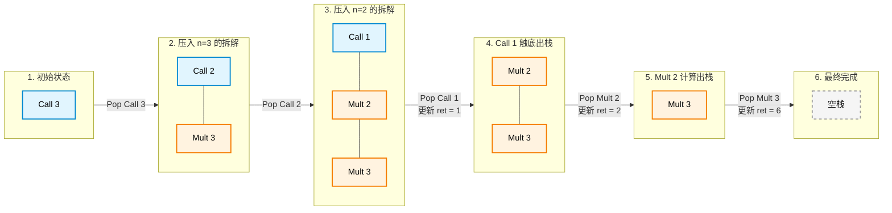

## 栈和递归

### LIFO 后进先出

### 递归调用
需要有一个结束递归的条件，否则会持续创建栈，直到栈溢出。

- 拆解出递归表达式
- 手动维护每次调用前的状态记录，调用后的状态恢复

#### 计算n的阶乘

递归表达式
```
f(n) = n * f(n-1)
```

每次调用需要：
- f(n-1)的值
- n的值

f(n-1)的值返回给调用者f(n)，而f(n-1)的值由f(n-2) * (n - 1)得来

于是发现，要么f(n-1)需要计算不知道，要么就是知道f(n-1)




代码演示

```c++
// 定义指令类型
enum class TaskType {
    Call,       // 需要继续向下递归的计算指令
    Multiply    // 向上回溯时的乘法指令
};

// 定义指令结构体
struct Task {
    TaskType type;
    int n;
};

int calculate_factorial(int n) {
    std::stack<Task> task_stack;
    task_stack.push({TaskType::Call, n}); // 初始压入第一条指令
    
    int return_value = 1; // 模拟 CPU 寄存器，存放子任务的返回值

    while (!task_stack.empty()) {
        Task current_task = task_stack.top();
        task_stack.pop();

        if (current_task.type == TaskType::Call) {
            if (current_task.n == 1) {
                // 遇到 n=1，直接返回 1，不再产生新指令
                return_value = 1; 
            } else {
                // 注意压栈顺序：先压入稍后执行的乘法，再压入立即执行的下一层 Call
                task_stack.push({TaskType::Multiply, current_task.n});
                task_stack.push({TaskType::Call, current_task.n - 1});
            }
        } else if (current_task.type == TaskType::Multiply) {
            // 执行乘法指令，更新返回值寄存器
            return_value = current_task.n * return_value;
        }
    }

    return return_value;
}
```


